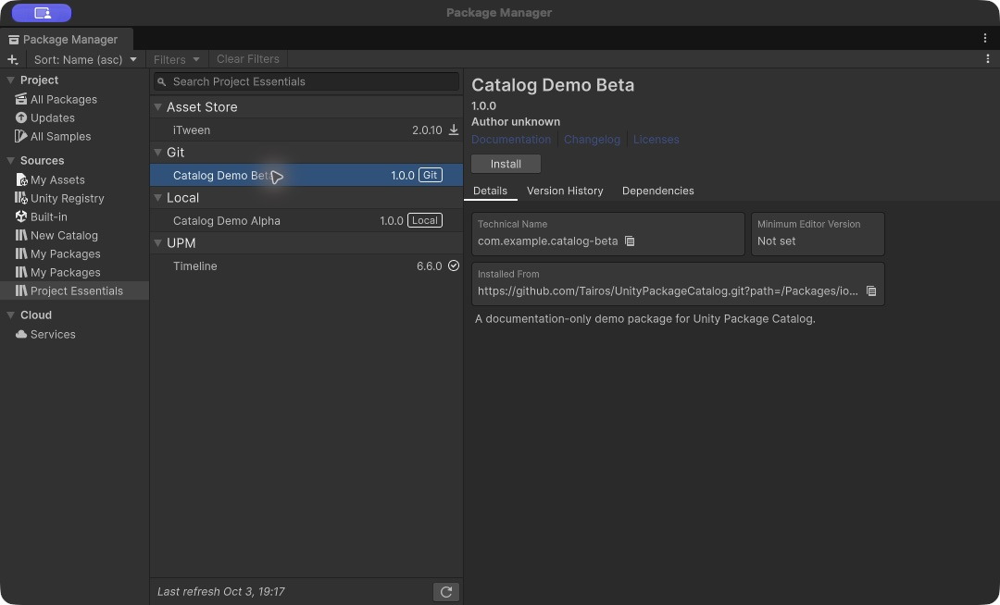
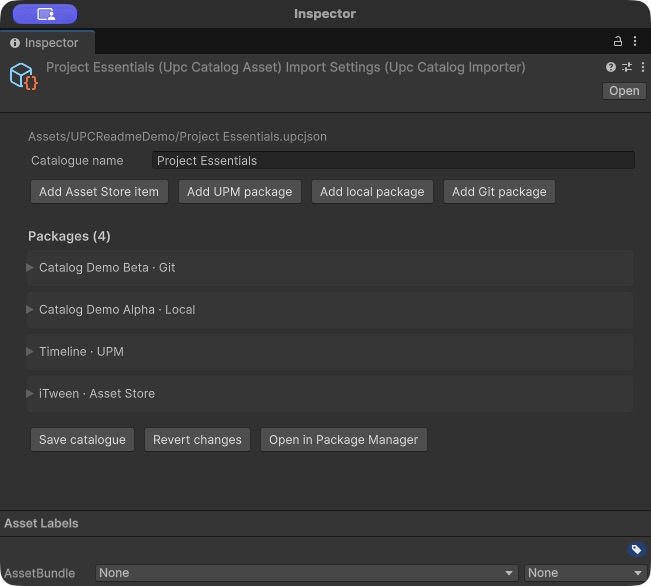
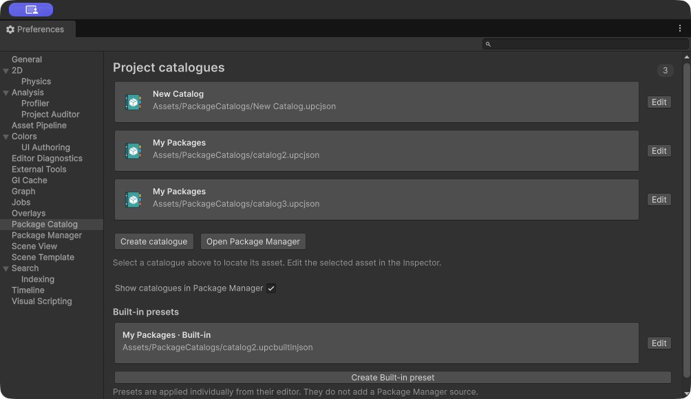
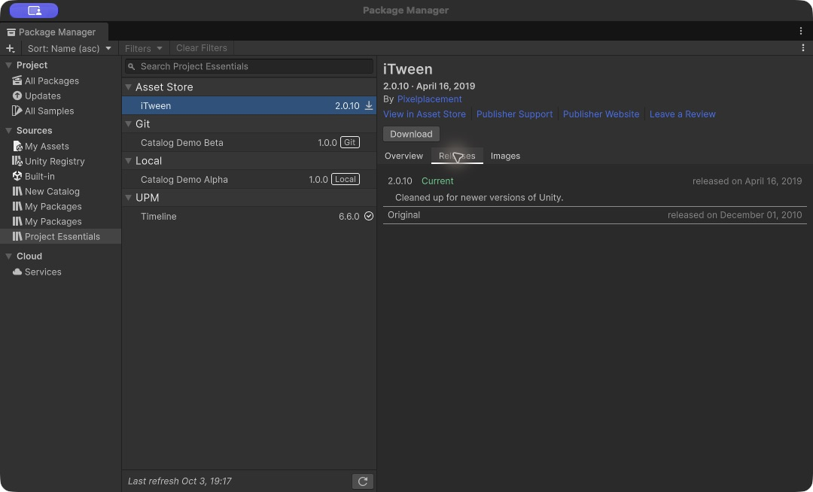
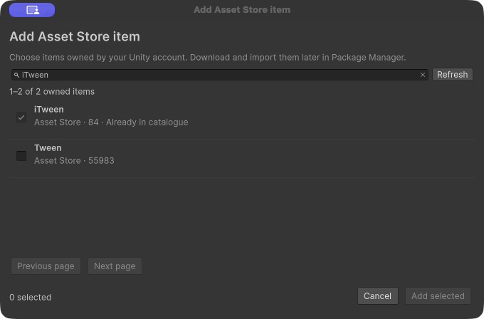
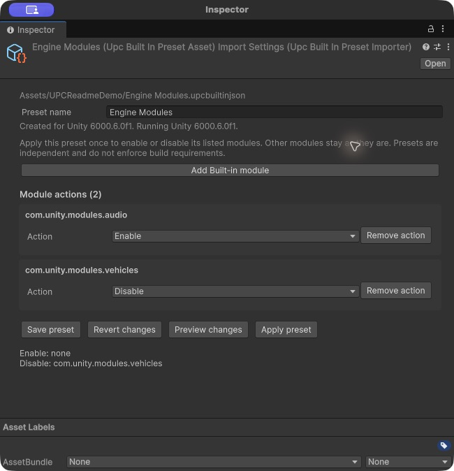

# Unity Package Catalog

**Your Unity package collections, inside Package Manager.**

Git repositories · Local packages · Unity packages · Asset Store collections


[](LICENSE)

Unity Package Catalog is a Unity Editor extension for **personal package catalogues and reusable package collections**. Bring your Git tools, local packages, Unity packages, and owned Asset Store items together in one collection. Each catalogue becomes a source in Unity's existing Package Manager, using its native search, details, Install, Remove, Download, and Import controls.

Create collections for different projects or workflows, then install only the packages you need.



> **Experimental compatibility:** tested with Unity **6000.6.0f1**. The native Package Manager integration uses undocumented Unity internals and targets Unity **6000.6**. Other Unity minor versions are not supported by the current adapter.

## What you get

| Feature | What it does |
|---|---|
| Multiple catalogues | Every imported `.upcjson` asset gets its own source under **Sources**. |
| Mixed package collections | Combine public/private Git repositories, local package folders, Unity packages, and Asset Store product references. |
| Native Package Manager UI | Browse, search, install/remove packages, and download/import owned Asset Store items through Unity's controls. |
| Inspector authoring | Select a catalogue asset to edit it. Searchable pickers help you choose packages and owned Asset Store items. |
| Built-in module presets | Separate `.upcbuiltinjson` assets preview and apply module enable/disable actions independently. |
| Shareable JSON | Keep catalogues in a project or distribute them inside a collection package.  |

## Install

In Unity's Package Manager, choose **+ → Install package from Git URL**:

```text
https://github.com/Tairos/UnityPackageCatalog.git?path=/Packages/io.github.tairos.unity-package-catalog
```

Unity needs Git installed on your computer to install this package.

## Make your first collection

1. Choose **Assets → Create → Unity Package Catalog**.
2. Select the new `.upcjson` asset and set its **Catalogue name** in the Inspector.
3. Add packages with **Add Git package**, **Add local package**, **Add UPM package**, or **Add Asset Store item**.
4. Click **Save catalogue**, then **Open in Package Manager**.
5. Select your collection under **Sources** and install individual packages when you need them.



Your saved catalogues appear automatically in Package Manager.

## Manage your collections

Open **Window → Package Management → Package Catalog Settings** to see all catalogues and Built-in presets in your project. Click a catalogue to select it, or **Edit** to open it in the Inspector. You can also create collections here and choose whether they appear in Package Manager.



## Asset Store collections

Group your owned Asset Store items with the packages that belong to the same workflow. The picker searches your signed-in Unity account's purchases; the catalogue stores product IDs, not asset files or credentials.



Choose items from your account using the Asset Store picker:




Each user must own the referenced products. Unity handles authentication, entitlements, Download, and Import. **Sharing a catalogue does not redistribute Asset Store content or grant access to it.** Imported Asset Store content follows Unity's normal asset import workflow rather than UPM installation/removal.

## Built-in module presets

Choose **Assets → Create → Unity Built-in Preset** and select the `.upcbuiltinjson` asset. Add modules, choose **Enable** or **Disable**, then **Preview changes** before using **Apply preset**.



A preset changes only the modules you list, when you click **Apply preset**. Use different presets for different project needs. You can see the resulting module state under **Built-in** in Package Manager.

## Share collections from GitHub

A collection package can contain its own `package.json` and `.upcjson`, with no dependencies on its optional tools. Installing that package makes its catalogue available; the referenced packages remain optional.

```text
YourCollection/
└── Packages/
    ├── collection/       # package.json + collection.upcjson
    ├── tool-a/           # package.json + implementation
    └── tool-b/           # package.json + implementation
```

Install `collection` using a Git URL with `?path=/Packages/collection`. Catalogue entries can reference the other folders using their own Git URLs and paths. Keep each package's ID and version consistent with its manifest, and pin Git revisions when sharing a stable collection.

Update the collection package in Unity to receive new additions to its catalogue.

For more detail on catalogue entries and sharing collections, see the [user guide](Packages/io.github.tairos.unity-package-catalog/README.md).

## License

[0BSD](LICENSE): use, modify, and redistribute the tool, including commercially, without an attribution requirement. Referenced packages and Asset Store content retain their own licenses.
